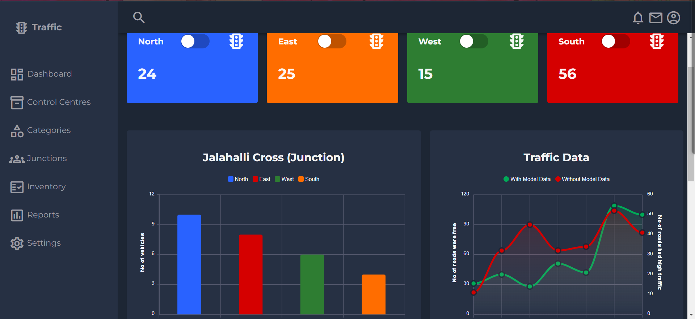

# Traffic Management Dashboard

Traffic Management Dashboard is a web-based application designed to visualize and manage traffic data in real-time. It provides insights into traffic patterns, congestion levels, and other relevant metrics to aid in traffic management and planning.

## Deployed Application

🚀 **Check out the live version of Traffic Managment Dashboard!** 🚀

[](https://traffic-management-dashboard.vercel.app/)


## Description

This project utilizes HTML, CSS, and JavaScript to create an interactive dashboard that displays traffic-related information. It includes features for viewing live traffic data, analyzing historical trends, and generating reports for decision-making purposes.

## Features

- **Real-time Data:** Visualize live traffic updates and status.
- **Interactive Maps:** Display traffic flow and congestion on maps.
- **Analytics:** Analyze historical data to identify trends and patterns.
- **User-friendly Interface:** Intuitive dashboard layout for easy navigation and data visualization.

## Technologies Used

- **HTML:** Structure and layout of the dashboard.
- **CSS:** Styling and design elements.
- **JavaScript:** Dynamic and interactive features.
- **Other:** APIs or frameworks used for mapping and real-time data integration (if applicable).

  ## Screenshots



## Usage

1. **Clone the Repository**:

   ```bash
   git clone https://github.com/srihari-976/Traffic-Management-Dashboard.git
   cd Traffic-Management-Dashboard

2. **Open the Dashboard:**

- Open the index.html file in a web browser.
- Navigate through different sections of the dashboard to view traffic data.
  
3. **Explore Features:**

- Click on interactive elements (maps, charts) to view detailed information.
- Use filters or settings (if implemented) to customize data views.
